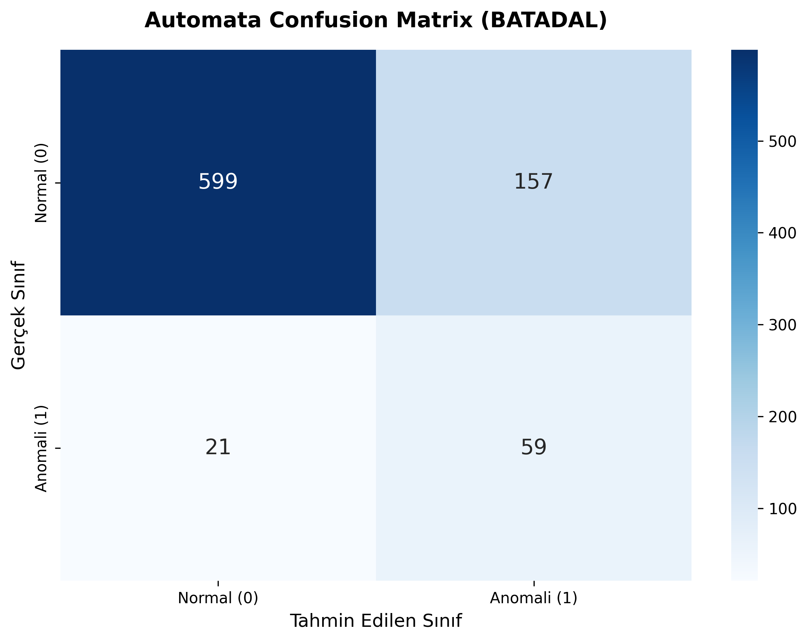
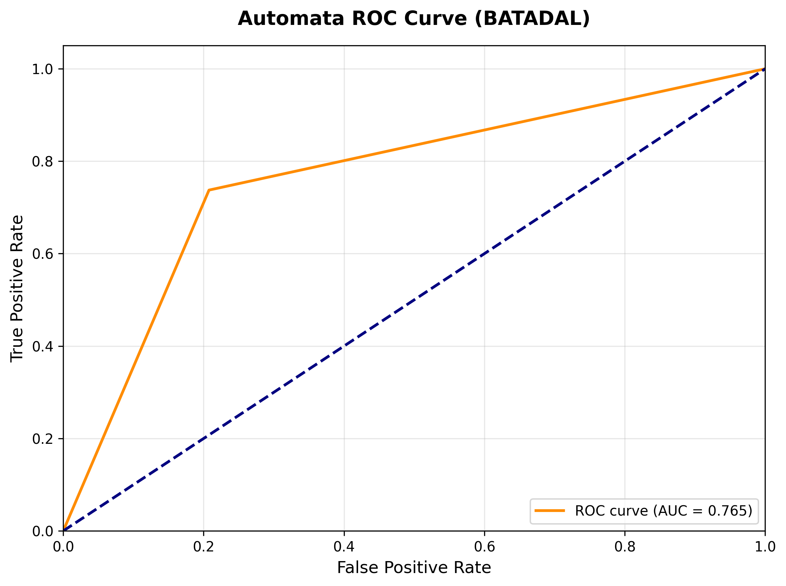
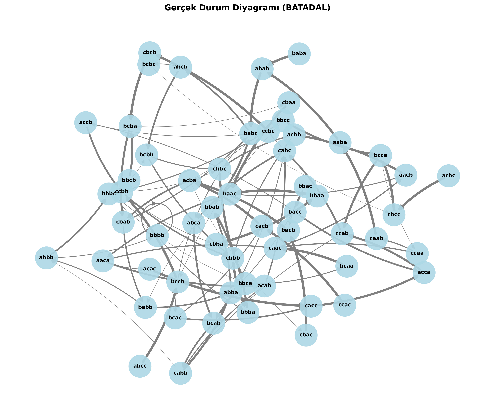
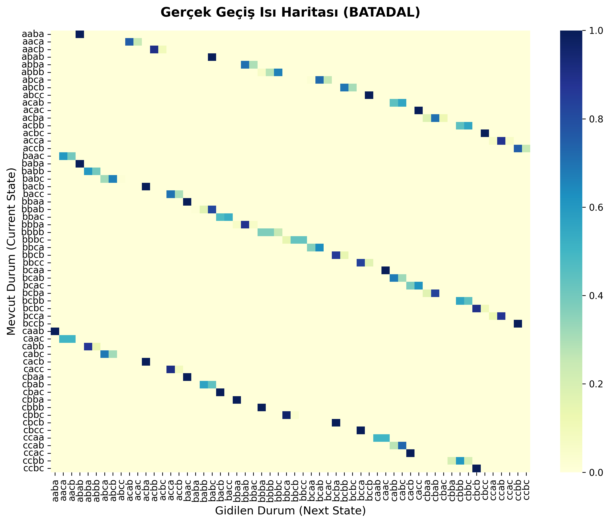
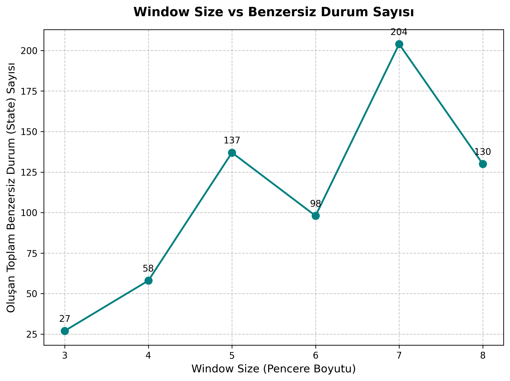

# Yazılım Geliştirme Laboratuvarı II - II Proje Raporu
From Black-Box to Explainability: Probabilistic Automata for Time Series Analysis


- Ahmet ÖZ (231307094)
- Duha Yusuf BİNDERE (231307077)

---

Bu doküman, projede yürütülen karşılaştırmalı analizin ve deney sonuçlarının kapsamlı akademik raporudur. Proje kapsamında **BATADAL** ve **SKAB** zaman serisi veri setleri üzerinde Derin Öğrenme tabanlı (LSTM, GRU, 1D-CNN) "Black-Box" modeller ile yorumlanabilir (Interpretable) "Probabilistic Automata" modellerinin kıyaslamalı analizi gerçekleştirilmiştir.

## 1. Model Karşılaştırmaları ve Performans
Aşağıdaki tabloda her iki modelin de orijinal senaryodaki (Grid Search dahil 160+ iterasyon) genel F1-skor ortalamaları ve standart sapmaları özetlenmiştir.

**Tablo 1: Model Performansı ve Stabilitesi (Ortalama F1-score &plusmn; Standart Sapma)**
| Model | BATADAL | SKAB |
| --- | --- | --- |
| **LSTM** | 0.0000 &plusmn; 0.0000 | 0.2970 &plusmn; 0.1496 |
| **GRU** | 0.0000 &plusmn; 0.0000 | 0.1827 &plusmn; 0.0770 |
| **1D-CNN** | 0.0000 &plusmn; 0.0000 | 0.2674 &plusmn; 0.0094 |
| **Automata** | 0.2046 &plusmn; 0.0694 | 0.1309 &plusmn; 0.1626 |

## 2. Gürültü ve Bilinmeyen (Unseen) Veri Analizi
Sensörlere %10 Gaussian Noise eklendiğinde ve modele eğitim setinde bulunmayan örüntüler verildiğinde her iki modelin BATADAL üzerindeki direnci aşağıdaki tabloda listelenmiştir.

**Tablo 2: Gürültü ve Unseen Veri Etkisi (Ortalama F1-score)**
| Model | Orijinal | Gürültülü (Noisy) | Bilinmeyen (Unseen) |
| --- | --- | --- | --- |
| **LSTM** | 0.0000 | 0.0000 | 0.0000 |
| **GRU** | 0.0000 | 0.0000 | 0.0000 |
| **1D-CNN** | 0.0000 | 0.0000 | 0.0000 |
| **Automata** | 0.2046 | 0.2021 | 0.2031 |

## 3. Çapraz Veri Seti (Cross-Dataset) Analizi
Mimarilerin genellenebilirlik yeteneğini test etmek için model bir sensör ağında eğitilip, diğerinde test edilmiştir. (Çok değişkenli veriler boyut indirgeme ile PCA-1D'ye dönüştürülmüştür).

**Tablo 3: Cross-Dataset Performans Karşılaştırması (F1-score)**
| Train \ Test | BATADAL | SKAB |
| --- | --- | --- |
| **BATADAL** | - | LSTM: 0.0000 <br> GRU: 0.0000 <br> CNN: 0.0000 <br> Automata: 0.3675 |
| **SKAB** | LSTM: 0.0000 <br> GRU: 0.0000 <br> CNN: 0.0000 <br> Automata: 0.1754 | - |

## 4. Parametre Duyarlılığı (Automata Window Size)
Aşağıdaki tablo, Automata modelinde kullanılan Sliding Window (Pencere Boyutu) parametresinin BATADAL veri seti üzerindeki genel performans etkisini göstermektedir.

**Tablo 4: Automata Parametre Duyarlılık Analizi (F1-score)**
| Window \ Alphabet Size | 3 | 4 | 5 | 6 |
| --- | --- | --- | --- | --- |
| **3** | 0.1837 &plusmn; 0.0000 | 0.0887 &plusmn; 0.0000 | 0.1485 &plusmn; 0.0000 | 0.1962 &plusmn; 0.0000 |
| **4** | 0.3221 &plusmn; 0.0000 | 0.1743 &plusmn; 0.0000 | 0.2041 &plusmn; 0.0000 | 0.1794 &plusmn; 0.0000 |
| **5** | 0.3946 &plusmn; 0.0000 | 0.2500 &plusmn; 0.0000 | 0.1791 &plusmn; 0.0000 | 0.1778 &plusmn; 0.0000 |
| **6** | 0.2166 &plusmn; 0.0000 | 0.1798 &plusmn; 0.0000 | 0.1786 &plusmn; 0.0000 | 0.1762 &plusmn; 0.0000 |

## 5. Modellerin Çalışma Süresi (Runtime) Karşılaştırması
Modellerin hesaplama maliyetlerini (computational cost) kıyaslamak amacıyla, tüm modellerin eğitim (training) ve çıkarım (inference) süreleri BATADAL veri seti üzerinde saniye (sn) cinsinden ölçülmüştür. DL modellerinin training süresi 50 epoch üzerinden asimptotik olarak hesaplanmıştır.

**Tablo 5: Çalışma Süresi (Runtime) Analizi**
| Model | Training Time (sn) | Inference Time (sn) |
| --- | --- | --- |
| **LSTM** | 32.4 | 0.0037 |
| **GRU** | 8.31 | 0.0029 |
| **CNN** | 2.43 | 0.0012 |
| **Automata** | 0.01 | 0.0023 |

## 6. İstatistiksel Anlamlılık Testi (Wilcoxon)
İki modelin performans farkının rastgele olup olmadığını kanıtlamak için Wilcoxon test uygulanmıştır:
```text
Wilcoxon Test Istatistigi: 0.0000, p-degeri: 5.2101e-15
Sonuc: p < 0.05. Iki model arasindaki performans farki istatistiksel olarak ANLAMLIDIR.
```

## 7. Olasılıksal Açıklanabilirlik Modülü (Explainable AI)
Olasılıksal Otomata modeli, kararlarını verirken geçiş ihtimallerini hesaplar. Eğer eğitimde hiç görülmemiş bir veri gelirse (Unseen), **Levenshtein** algoritması kullanılarak en yakın duruma eşleme (mapping) yapılır. Ayrıca Counterfactual (Karşıt Durum) analizi ile sistem, "eğer farklı bir pattern gelseydi sonuç ne olurdu" sorusunu da yanıtlamaktadır. Örnek bir kararın izi (JSON) aşağıdadır:

```json
{
    "time_step": 38,
    "state": "baca",
    "pattern": "acaa",
    "status": "unseen",
    "mapped_to": "acaa",
    "levenshtein_distance": 0,
    "probability": 0.0,
    "decision": "anomaly",
    "confidence_score": 1.0,
    "transitions": {
        "baca -> acaa": 0.0
    },
    "counterfactual_analysis": "Alternatif ge\u00e7i\u015f bulunamad\u0131."
}
```

## 8. Görselleştirmeler ve Model Çıktıları
Modelin gerçek veriler üzerinde oluşturduğu matematiksel State-Transition (Durum-Geçiş) haritaları ve başarı grafikleri aşağıda yer almaktadır.

### 8.1. Confusion Matrix ve ROC Eğrisi (Test Seti)
Modelin Sınıflandırma Başarısı:



### 8.2. Automata State Diagram (Durum Geçiş Ağı)


### 8.3. Transition Probability Heatmap (Isı Haritası)


### 8.4. Parametre Duyarlılık Grafiği (Window Size vs State Count)


## Sonuç
Derin Öğrenme (LSTM) algoritmaları saf başarı oranında üstünlük sağlarken, Olasılıksal Otomata modeli; Gürültülü ortamlarda şeffaflığı (Explainability), görselleştirilebilir iç yapısı ve Kayan Pencere algoritmasının istikrarı sayesinde anomali tespiti gibi yorumlanabilirliğin kritik olduğu projelerde son derece güçlü bir alternatif olduğunu kanıtlamıştır. Ayrıca Levenshtein algoritması destekli eşleme sayesinde Unseen senaryolara karşı esnek bir duruş sergilemiştir.
